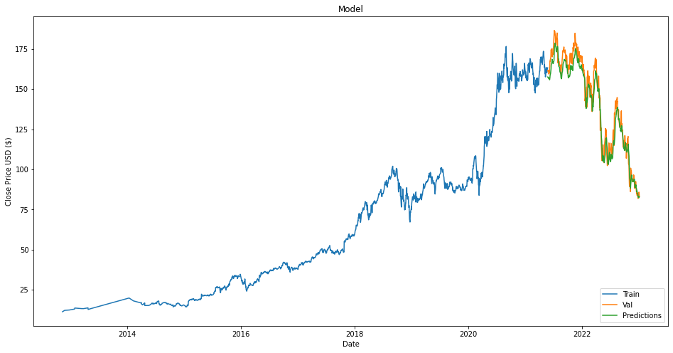

# ID2223 Project
## Project: Market Stock Prediction Using Sentiment Analysis
**Professor:**
Jim Dowling

**Students:**
- Yilin Chang
- Zineb Senane

## Task description
The objective of our project is to develop a data-driven model that can predict the future behavior of selected stock market indices, based on real-time stock data and sentiment analysis for stock news.


## Infrastructure Model
- Feature Pipeline. 
- Training Pipeline.
- Inference Pipeline/User Interface.


## Feature Engineering Pipeline
We used two different data sources: Yahoo Finance API to get historical and live stock market prices for three different companies Apple, Amazon, and Meta, and we scrapped the economic news related to those three companies from Investing.com using BeautifulSoup library.
the pipeline retrieves the data from both sources, computes the sentiment analysis score for each news article using Vader analyzer and stores them on Hopsworks first. Next, the feature view notebook uploads this data from Hopsworks and aggregates the news dataset based on the date and merge the two datasets and pushes them again to Hopsworks as a feature group and creates training data. \
In the end, we also update daily stock news sentiments and stock price data in update_data_daily notebook. The new data will be used for prediction or retraining our model.

## Training Pipeline
In order to predict the future stock market price, we created three different models one for each company. This pipeline retrieves first the training data, refactors it into three different datasets, creates a model for each and fits the data. At the end, we test the model on a subset of unseen data to control the rmse error on the testing data.

### Model Structure
In order to perform the prediction, we used LSTM model. The architecture we used is as follows:

Model: "sequential"

| Layer (type)         |       Output Shape      |        Param    
|:-------------------:|:-----------------------:|:--------------:|
| lstm (LSTM)          |       (None, 60, 100)   |        42400  |  
|                      |                         |               |   
| lstm_1 (LSTM)        |       (None, 100)       |        80400  |   
|                      |                         |               |   
| dense (Dense)        |       (None, 25)        |        2525   |   
|                      |                         |               |   
| dense_1 (Dense)      |       (None, 1)         |        26     |   
                                                                 
- Total params: 125,351
- Trainable params: 125,351
- Non-trainable params: 0

### Model Performance
Below are the test results for the models of three companies.\
  <center>LSTM Model for Apple</center>

 <center>LSTM Model for Amazon</center>

 <center>LSTM Model for Meta</center>


## Inference Pipeline/User Interface
We used streamlit to create a user interface. Users can select one of those three companies and check the stock price today, news sentiments for today, and the stock price prediction for tomorrow. An example view of the UI shows as follows. \

Under [huggingface](/huggingface) folder lies all the files for UI. To run the UI, you need to install streamlit package first. Then simply run:
```console
streamlit run app.py
```
We also run our UI on HuggingFace Space. Here you can access our [space](https://huggingface.co/spaces/Yilin98/Stock_Prediction). However, the space right now is not working properly, due to some issue with connecting Hopsworks FeatureGroups on Huggingface. We are still trying to find a solution.